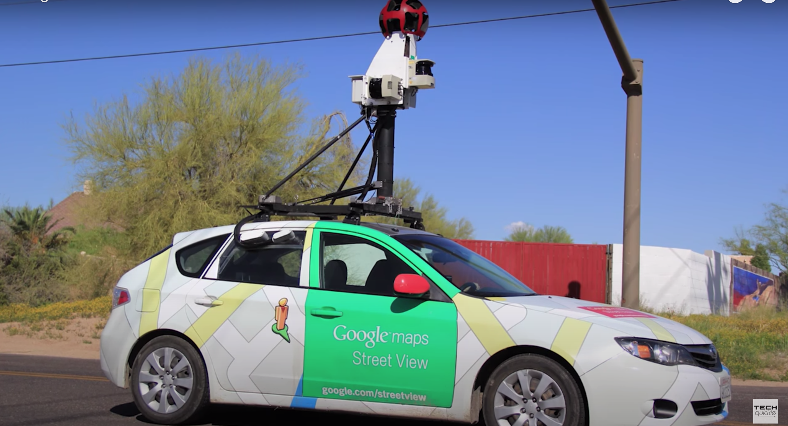
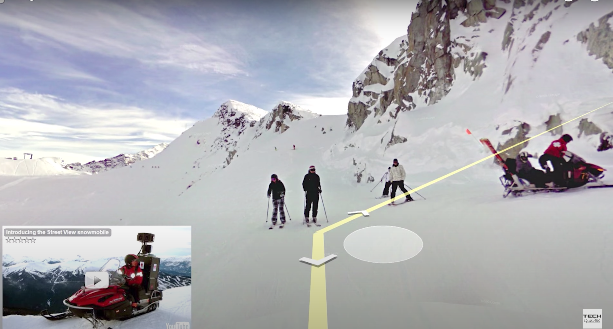
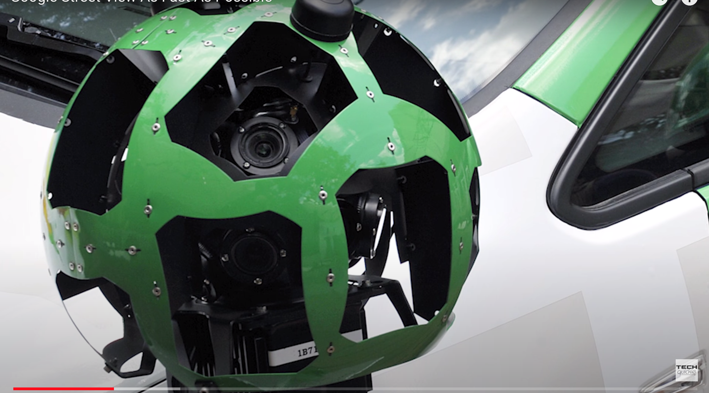
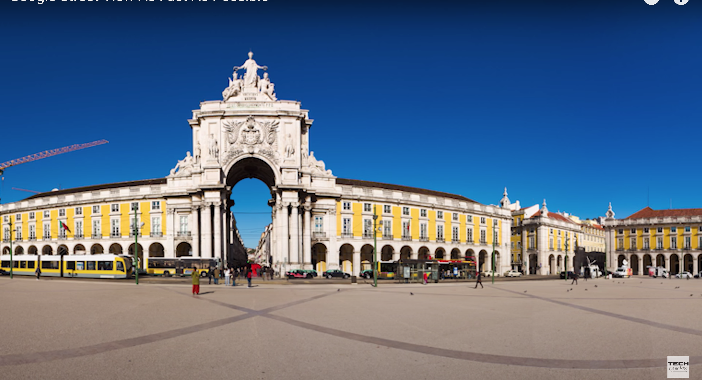
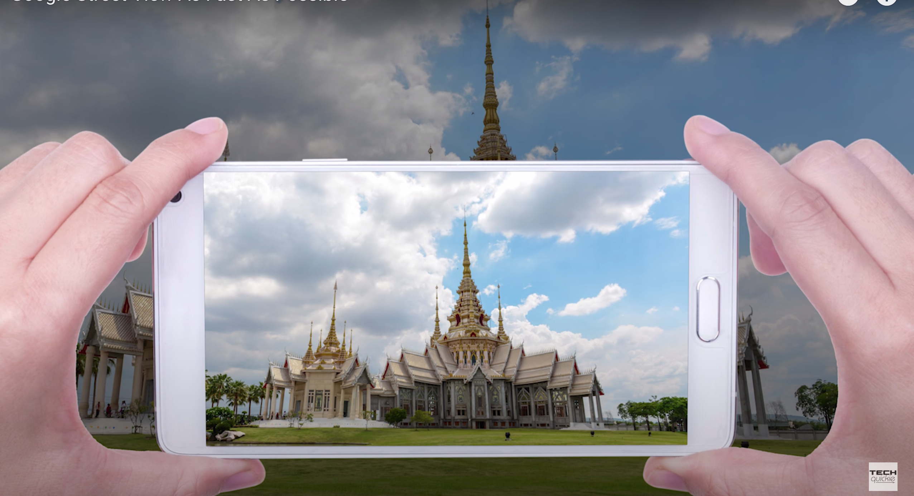
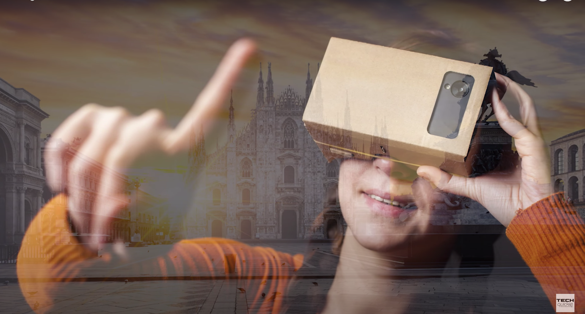

# google-street-view
- Launched in 2007
- Capture images using high definition camera

- Google built it's own camera

- Create 360 view by stiching these picture gives panoramic view

- laser feature to see the 3d view of architecture 

- user can upload it's own

- Google card board

# Reference
https://www.youtube.com/watch?v=yEbMlXNqOQY
